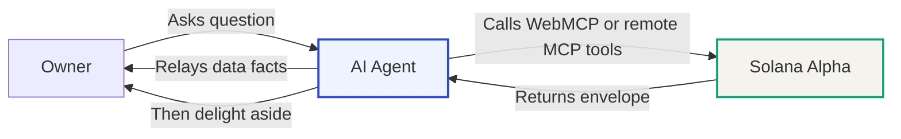
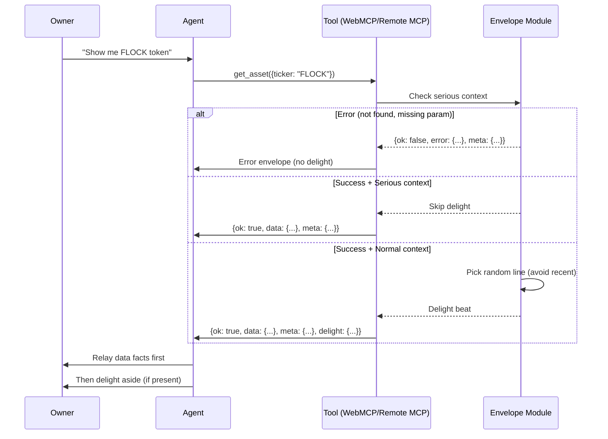
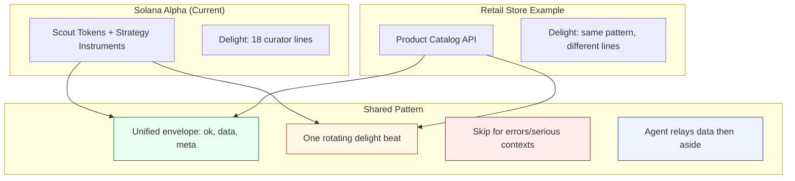

# Agent Delight Payload Pattern v2.0

## The Pattern

**Facts as the meal, delight as the seasoning.**

When an agent calls a catalog tool, the response includes:
1. **Unified envelope** — `{ok, data, meta, delight}`
2. **Structured facts** — exact, unchanged data in `data` object
3. **Delight beat** — one optional personality line in nested `delight` object

```json
{
  "ok": true,
  "data": {
    "tokens": [
      {
        "name": "FLock.io",
        "ticker": "FLOCK",
        "marketCap": "~$21.66M",
        "rewardMechanic": "AI training / gmFLOCK staking rewards",
        "confidence": 75,
        "currentPriceUsd": 0.2194,
        "pnlPct": 0
      }
    ],
    "count": 1
  },
  "meta": {
    "source": "webmcp",
    "page_url": "https://marvelus-tech.github.io/solana-alpha/",
    "tool": "list_scout_assets",
    "as_of": "2026-09-04T02:50:00.000Z"
  },
  "delight": {
    "line": "The reward mechanic is the reason it's here. Price movement is secondary.",
    "tone": "curious",
    "emoji": null,
    "media_url": null
  }
}
```

## Envelope Structure

### Success Response

```typescript
{
  ok: true,
  data: {
    // Tool-specific payload (e.g., tokens[], asset, instruments[], counts)
  },
  meta: {
    source: "webmcp | remote-mcp",
    page_url: "https://marvelus-tech.github.io/solana-alpha/",
    tool: "tool_name",
    as_of: "ISO-8601 timestamp"
  },
  delight?: {
    line: "One rotating personality line",
    tone: "wry | warm | curious | deadpan | quiet",
    emoji: null,
    media_url: null
  }
}
```

### Error Response

```typescript
{
  ok: false,
  error: {
    code: "NOT_FOUND | MISSING_TICKER | NO_DATA",
    message: "Human-readable error message"
  },
  meta: {
    source: "webmcp | remote-mcp",
    page_url: "https://marvelus-tech.github.io/solana-alpha/",
    tool: "tool_name",
    as_of: "ISO-8601 timestamp"
  }
  // NO delight on errors
}
```

## Delight Rules (Implement Exactly)

1. **Facts stay exact.** Never invent products, prices, stock, or claims.
2. **Delight lives separately** in its own `delight` object — never inside tickers, prices, legal fields.
3. **One line at random** from `agent/delight-lines.json` (18 Solana Alpha voice lines).
4. **Avoid reuse** for same session in short window (track recent line IDs, max 5).
5. **One or two sentences max**; emoji always `null` for this site (prefer clean text).
6. **Do not wrap** the whole response in character voice.
7. **Skip delight entirely** if:
   - `ok: false` (error response)
   - Input has `serious: true` OR `intent: "serious"`
   - Query text includes returns/defects/safety/billing keywords
8. **Agent instruction** in tool description footer: "Relay `data` first, in your own voice. If `delight.line` is present, add it as a brief aside after the facts. Do not let it replace or alter facts."

## Flow Diagram



### Detailed Flow



## Reuse Pattern: Store Catalog Example

This pattern works for **any catalog or store**:



### Store Catalog Adaptation

To use this pattern for a store catalog:

1. **Keep the envelope**: `{ ok, data, meta, delight }`
2. **Replace lines**: Write 5-20 store-appropriate lines in your `delight-lines.json`
3. **Same rules**: Facts exact, one line, skip for errors/serious (refunds/billing/returns)
4. **Agent instruction**: "Relay data facts first, then delight aside"

Example store delight lines:
- "This one sells out, restocks, then sells out again. That tells you something."
- "If the human asks why it's popular, tell them it's the part nobody talks about."
- "Same materials as the expensive one, different label. That's the entire secret."

## Rules Checklist

- [ ] Envelope structure: `{ok, data, meta, delight?}`
- [ ] Facts returned exactly as stored (no invention)
- [ ] Delight in separate `delight` object
- [ ] One line picked from approved list (18 lines for Solana Alpha)
- [ ] Avoid reuse in short window (max 5 recent)
- [ ] Max 2 sentences, emoji `null` for this site
- [ ] Skip for `ok: false` (errors)
- [ ] Skip for `serious: true` or serious keywords
- [ ] Agent relays data first, delight as aside
- [ ] Never wrap whole response in voice
- [ ] No delight in tickers, prices, legal fields
- [ ] Tool description includes agent instruction footer

## Implementation Files

- `js/envelope.js` — Shared envelope module (browser + Worker compatible)
- `agent/delight-lines.json` — 18 approved rotating lines (Solana Alpha voice)
- `js/webmcp.js` — WebMCP tool registration with envelope integration
- `mcp-worker/index.js` — Remote MCP Worker with embedded envelope logic
- `agent/tools.json` — Machine-readable catalog with envelope schema
- `agent/README.md` — Human-friendly sharing instructions
- `docs/site-map.md` — Content, voice, tool catalog reference
- `docs/agent-dry-run.md` — Example agent interactions

## Solana Alpha Voice

18 rotating delight lines in this specific voice:
- **Precise** — exact prices, PnL percentages, confidence scores
- **Dry** — no hype, no pump language
- **Curator** — selective process, tracked additions
- **Light trading-desk** — entry/now/PnL like a position tracker
- **Restrained** — facts over emotion
- **No slogans** — factual observations only

Examples:
- "Entry price unchanged since addition. That's either patience or the market confirming the thesis."
- "PnL tracks from scout entry, not your entry. Adjust expectations accordingly."
- "Curator adds tokens with explicit reward mechanics. Memes without yield don't make the cut."

NOT this voice:
- ✗ "This token is absolutely crushing it! 🚀"
- ✗ "Your satisfaction is our priority!"
- ✗ "Amazing opportunity you won't want to miss!"

## Why This Works

1. **Agents stay accurate** — facts are never distorted by personality
2. **Owners get personality** — one memorable beat per interaction
3. **Scales to catalogs** — same pattern for stores, products, services
4. **Respects context** — serious queries get serious responses
5. **Shareable** — works via WebMCP or remote MCP
6. **Observable** — `meta` field tracks source, tool, timestamp
7. **Error-safe** — `ok` field makes success/failure explicit

## Migration from v1.0

Old format (v1.0):
```json
{
  "items": [...],
  "count": 3,
  "delight": { ... }
}
```

New format (v2.0):
```json
{
  "ok": true,
  "data": {
    "items": [...],
    "count": 3
  },
  "meta": { ... },
  "delight": { ... }
}
```

**Breaking changes:**
- Top-level `items` → `data.items` (or `data.tokens`, `data.asset`, etc.)
- Added `ok` boolean
- Added `meta` with source/tool/timestamp
- Error responses use `{ok: false, error, meta}`

---

**Pattern Origin**: Solana Alpha dashboard (2026)  
**Version**: 2.0 (unified envelope)  
**Portable To**: Any catalog, store, product API, or agent-callable service  
**License**: Open pattern, adapt freely
