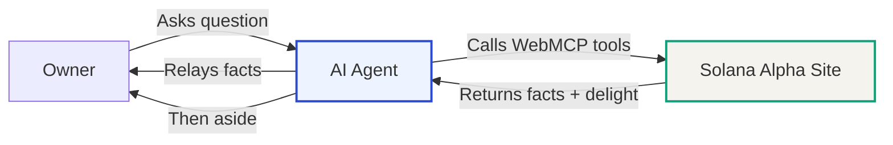
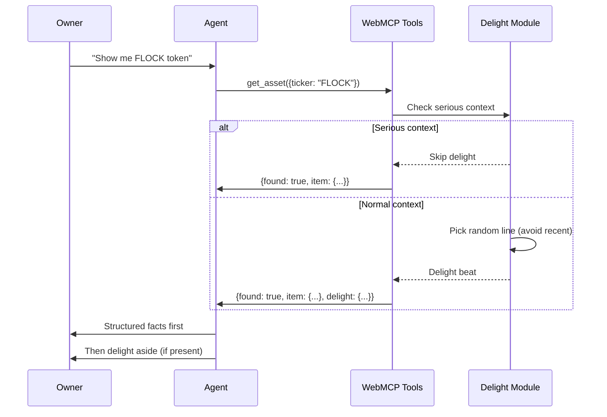
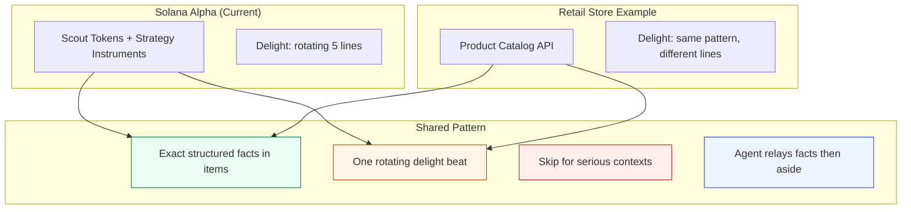

# Agent Delight Payload Pattern

## The Pattern

**Facts as the meal, delight as the seasoning.**

When an agent calls a catalog tool (`list_*`, `get_asset`), the response includes:
1. **Structured facts** — exact, unchanged product/asset data in `items` or `item`
2. **Delight beat** — one optional personality line in a nested `delight` object

```json
{
  "items": [
    {
      "name": "FLock.io",
      "ticker": "FLOCK",
      "marketCap": "~$21.66M",
      "rewardMechanic": "AI training / gmFLOCK staking rewards",
      "confidence": 75,
      "currentPriceUsd": 0.2194,
      "pnlPct": 0
    }
  ],
  "delight": {
    "line": "This isn't trying to be everything. That's usually the tell.",
    "tone": "curious",
    "emoji": "☕"
  }
}
```

## Delight Rules (Implement Exactly)

1. **Facts stay exact.** Never invent products, prices, stock, or claims.
2. **Delight lives separately** in its own `delight` object — never inside tickers, prices, legal fields.
3. **One line at random** from `agent/delight-lines.json` (5 approved lines).
4. **Avoid reuse** for same session in short window (track recent line IDs in sessionStorage).
5. **One or two sentences max**; optional one emoji on the delight line only (prefer ✦ · ☕ · 📦).
6. **Do not wrap** the whole response in character voice.
7. **Skip delight entirely** if:
   - Input has `serious: true` OR `intent: "serious"`
   - Query text includes returns/defects/safety/billing keywords
8. **Agent instruction** in tool description: "Relay structured items/facts first, then the delight line as a brief aside."

## Flow Diagram



### Detailed Flow



## Reuse Pattern: Store Catalog Example

This pattern works for **any catalog or store**:



### Store Catalog Adaptation

To use this pattern for a store catalog:

1. **Keep the structure**: `{ items: [...], delight: {...} }`
2. **Replace lines**: Write 5 store-appropriate lines in your `delight-lines.json`
3. **Same rules**: Facts exact, one line, skip for serious (refunds/billing/returns)
4. **Agent instruction**: "Relay product facts first, then delight aside"

Example store delight lines:
- "This one sells out, restocks, then sells out again. That tells you something."
- "If the human asks why it's popular, tell them it's the part nobody talks about."
- "Same materials as the expensive one, different label. That's the entire secret."

## Rules Checklist

- [ ] Facts returned exactly as stored (no invention)
- [ ] Delight in separate `delight` object
- [ ] One line picked from approved list
- [ ] Avoid reuse in short window (sessionStorage)
- [ ] Max 2 sentences, optional 1 emoji
- [ ] Skip for `serious: true` or serious keywords
- [ ] Agent relays facts first, delight as aside
- [ ] Never wrap whole response in voice
- [ ] No delight in tickers, prices, legal fields

## Implementation Files

- `agent/delight-lines.json` — 5 approved rotating lines
- `js/delight.js` — Delight selection logic
- `js/webmcp.js` — Tool registration with delight integration
- `agent/tools.json` — Machine-readable catalog
- `agent/README.md` — Human-friendly sharing instructions

## Why This Works

1. **Agents stay accurate** — facts are never distorted
2. **Owners get personality** — one memorable beat per interaction
3. **Scales to catalogs** — same pattern for stores, products, services
4. **Respects context** — serious queries get serious responses
5. **Shareable** — works via WebMCP or direct JSON fetch

---

**Pattern Origin**: Solana Alpha dashboard (2026)  
**Portable To**: Any catalog, store, product API, or agent-callable service  
**License**: Open pattern, adapt freely
